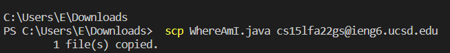

# Lab report 1: Learning SSH and remote access

**Learning objectives:**
- Installing VScode
- Remotely Connecting
- Trying Some Commands
- Moving Files with scp
- Setting an SSH Key
- Optimizing Remote Running

Within CSE15L, the recommended IDE is [VScode](https://code.visualstudio.com/download). To open terminal in VScode use ```crtl + ` ```. Remote connection will be conducted on the terminal and should look like the image below: 


To remotely connect we will utilize the ```ssh``` command. ```ssh``` stands for *secure shell* which allows two computers to remotely communicate and share data. To access the remote UCSD computers, students should type ```$ ssh cs15lfa22zz@ieng6.ucsd.edu ``` (the zz's should be replaced by the two letters unique to the students login user)
It should look like this: 


This prompt indicates that you have successfully connected to the remote computer and can now run commands that can access the files on the other computer. 

**Some cool commands**
``` 
cd ~
cd
ls -lat
ls -a
ls <directory> where <directory> is /home/linux/ieng6/cs15lfa22/cs15lfa22abc, where the abc is one of the other group members’ username
cp /home/linux/ieng6/cs15lfa22/public/hello.txt ~/
    cat /home/linux/ieng6/cs15lfa22/public/hello.txt
```

For example, running ```la -lat``` shows a list of the directory ```ls``` and ```-lat``` combines the functions of ```-l``` (use a long list format) ,```-a``` (do not ignore entries starting with . ) & ```-t``` (sort by modification time, newest first) 


To move files, we use ```scp``` which stands for *secure copy* which allows us to copy files between a you and a remote computer. 

To demonstrate this, we will create a local file called ```WhereAmI.java```, compile this using ```javac WhereAmI.java``` and running it using ```java WhereAmI.java``` in the terminal. 

```WhereAmI.java``` code: 
```
class WhereAmI {
  public static void main(String[] args) {
    System.out.println(System.getProperty("os.name"));
    System.out.println(System.getProperty("user.name"));
    System.out.println(System.getProperty("user.home"));
    System.out.println(System.getProperty("user.dir"));
  }
}
```

Now, copy it over to the remote computer using ```scp WhereAmI.java cs15lfa22zz@ieng6.ucsd.edu:~/``` , again, substituting zz for your own personal account. Running ls again will copy this to the remote computer and using ```javac``` and ```java``` commands again will compile no matter what the client as it is on both the remote computer and your own.

example: 
Now, copy it over to the remote computer using ```scp WhereAmI.java cs15lfa22zz@ieng6.ucsd.edu:~/``` , again, substituting zz for your own personal account. Running ls again will copy this to the remote computer and using ```javac``` and ```java```
 

compiling it again gives you: 

 

Though effective, scp requires you to enter a password *every time* which can get very redudant and troublesome when you need to do this multiple times. This can be solved by utilizing an ssh key which can take the place of your code: 


Lastly, to streamline this process further, you can run commands on the same string by using semicolons:

```$ cp WhereAmI.java OtherMain.java; javac OtherMain.java; java WhereAmI```
