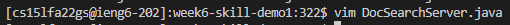
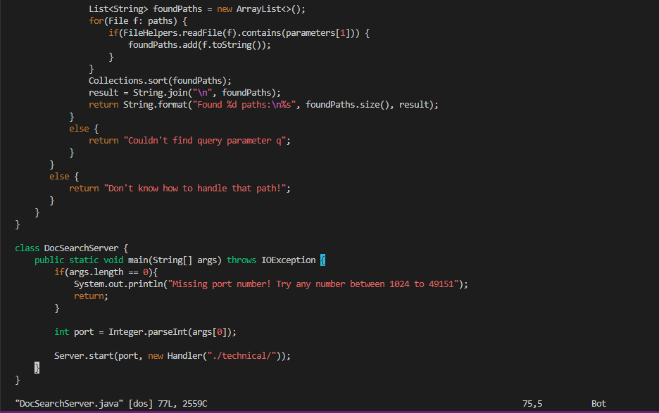
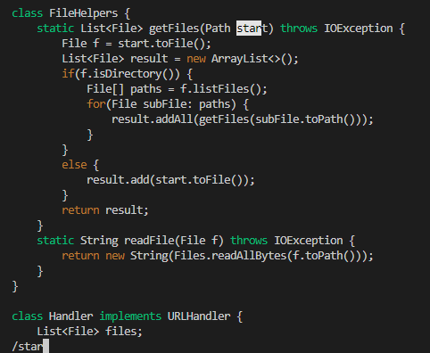
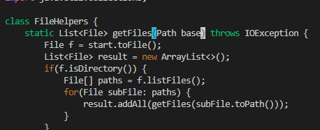

# Lab Report 4

## Part 1
In lab 6 my partner and I attempted the challenge task as described:
>In DocSearchServer.java, change the name of the start parameter of getFiles, and all of its uses, to instead be called base.

To achieve this in the shortest keystrokes possible, we have done the following in order: 

vim <space> <shift>+d <tab> <enter>
/star <enter> ce base <esc> . n . 
<shift>+; wq

This should look as follows: 
1) ```vim <space> <shift>+d <tab> <enter>```
  

  
Which will display:
  

  
2) /star <enter>
* the word we are looking for is 'start' however star is sufficient and more efficient to find 'start' 



3) ce base <esc>
 c will delete every character from the current cursor pos (aka where /star took us) to the end of the word (e). 


  


3) . n . <shift>+; wq
This step will repeat step 2 and apply it to the other instances of start
as the dot command will set it back to normal mode while n will repeat the last command and the semicolon will repeat the chain of commands.
wq will save all work and exit vim thus changing all instances of start to base 

## Part 2
As stated in the lab report instructions two strategies were tested two remote editing styles as stated below:
  
 >- Once, start in Visual Studio Code and make the edit there, then scp the file to the remote server and run it there to confirm it works (you can just run bash test.sh on the remote to test it out). Consider having the appropriate scp command in your command history or easily copy-pasteable!\
 >- Second, start already logged into a ssh session. Then, make the edit for the task you chose in Vim, then exit Vim and run bash test.sh.
  
 **Timing**
  - Strategy 1 had taken me ~4.5 minutes due to the amount of excess typing as well as messing up as a result
  - Strategy 2 had only taken me ~2.75 minutes as it was all already on the remote server and just a matter of becoming better about vim
  
  **Difficulties**
  - Strategy 1 was significantly more difficult especially due to demanding more accuracy when typing so much
  - Strategy 2 was easier, the only difficulty resting in how fluent you are in vim (I am not so fluent hence why I took longer)
  
  **Observations**
  - Generally speaking, it is far easier running things when they are centralized with as little keystrokes as possible
 
**Which of these two styles would you prefer using if you had to work on a program that you were running remotely, and why?**

  I would far prefer the second style as it is already running remotely and thus less keystrokes are needed to make it run smoothly with less oppurtunity for error. Additionally, you wouldnt need to dig around your own personal computer to find the directory to push it in the first place making for excessive typing when continuously using the scp command
  
**What about the project or task might factor into your decision one way or another? (If nothing would affect your decision, say so and why!)**

  A task that required multiple files that had to be continually switched out would probably be better running on an IDE instead of terminal which would make me prefer style one. However if it is just a single file, I far prefer style two for efficiency and accuracy reasons!
